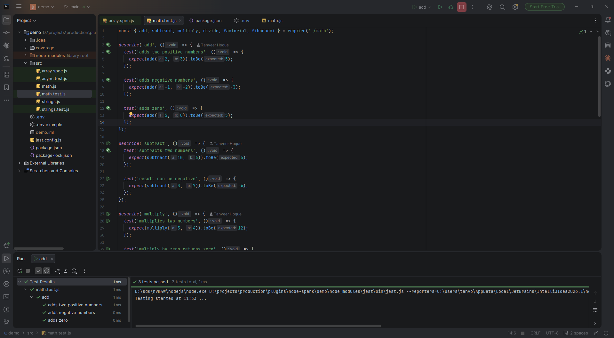
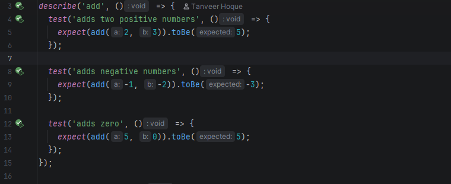
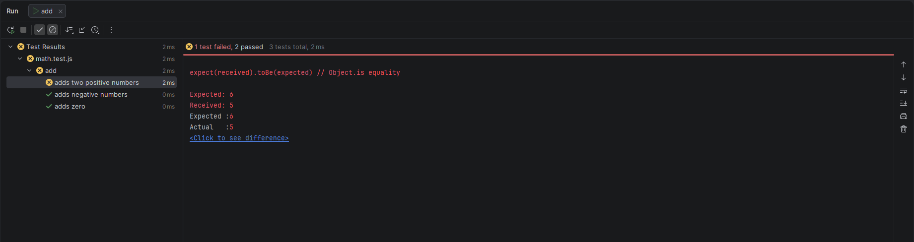
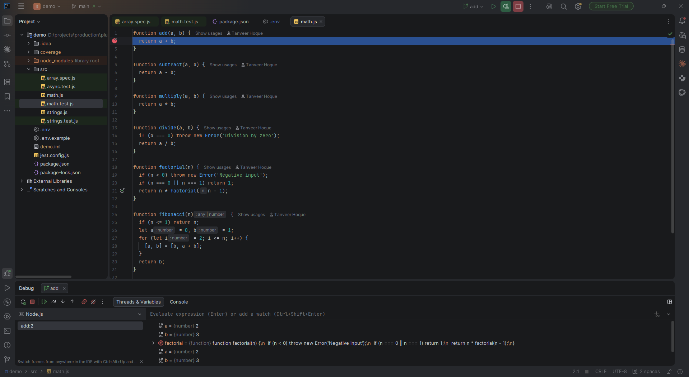
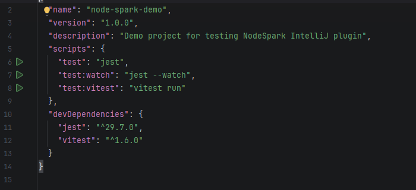
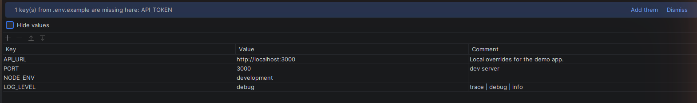
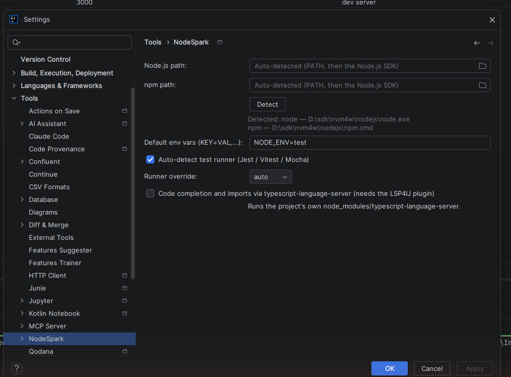

# NodeSpark

[](https://plugins.jetbrains.com/plugin/34061-nodespark)
[](https://plugins.jetbrains.com/plugin/34061-nodespark)

**Node.js support for IntelliJ IDEA Community.** Run and debug JavaScript and TypeScript tests,
package.json scripts and plain Node files — with a real pass/fail test tree — without a WebStorm
licence.

Everything runs against the tools the project already has in its own `node_modules`. Nothing is
downloaded, nothing is installed into your project, and nothing is executed until you trust the
project.

<p align="center">
  
</p>

---

## What you get

| | |
|---|---|
| ▶ **Run any test from the gutter** | Click the arrow next to a `describe`, `it` or `test` to run just that one. |
| 🌲 **A real test tree** | Nested suites, per-test timings, and *Click to see difference* on assertion failures. |
| 🐞 **Debugger** | Breakpoints in test files and plain scripts, or attach to a running `node --inspect`. |
| 📦 **package.json scripts** | A ▶ beside every script; npm / yarn / pnpm / bun detected automatically. |
| 🎨 **ESLint + Prettier** | Inline ESLint warnings; `Ctrl+Alt+L` formats with the project's own Prettier. |
| 📊 **Coverage (basic)** | **Tools → Node Coverage** runs the suite and paints an `lcov.info` into the gutter as covered/uncovered stripes. Manual only — no native Run-with-Coverage button yet, [see known issues](docs/known-issues.md#coverage-is-manual-not-ide-native). |
| 🔑 **`.env` editor** | Highlighting, duplicate-key warnings, and a key/value grid beside the text. |
| 💡 **Completion & imports** | Optional: drives the project's `typescript-language-server` over LSP. |
| ⚙️ **Node.js SDK** | A real SDK type in Project Structure, auto-detected from PATH, nvm and fnm. |

---

## Install

**From the Marketplace** — `Settings → Plugins → Marketplace` → search **NodeSpark** → Install, or
grab it from the [JetBrains Marketplace page](https://plugins.jetbrains.com/plugin/34061-nodespark) directly.

**From disk** — download the `.zip` from [Releases](../../releases), then
`Settings → Plugins → ⚙ → Install Plugin from Disk` and restart.

Two zips are published. Take the one matching your IDE: `241.x` for 2024.1 – 2025.3, `262.x` for
2026.2 and later. (Why two: [CONTRIBUTING.md](CONTRIBUTING.md#two-ide-variants).)

Requires IntelliJ IDEA **Community or Ultimate** and a Node.js install. Does not require WebStorm.

---

## Quick start

**1. Open a Node.js project.** Any project with Jest, Vitest, Mocha or `node --test` tests works
with no configuration.

**2. Open a test file and click ▶ in the gutter.**

<p align="center">
  
</p>

The run opens in the Run window with a live pass/fail tree.

<p align="center">
  
</p>

**3. That's it.** Click the arrow beside a `describe` to run that whole suite, or beside an `it` to
run the single test; right-click the arrow for **Debug**. Right-click anywhere in the file →
**Run '<file>.test.js'** runs the lot. Each run configuration is named after the `describe` chain it
came from — `UserService > login > returns a token` — and can be edited afterwards.

Only if something needs pointing at: add a Node.js SDK under
`File → Project Structure → SDKs → + → Node.js`, then pick it in `Settings → NodeSpark`.

---

## Features

### Tests

| Runner | Detected | Single test | Test tree |
|--------|----------|-------------|-----------|
| Jest | ✅ | `--testNamePattern` | ✅ |
| Vitest | ✅ | `-t` | ✅ |
| Mocha | ✅ | `--grep` | ✅ |
| `node --test` | ✅ | `--test-name-pattern` | ✅ |

The runner is read from the `test` script in `package.json` first, then the declared dependency,
then a config file, then `node_modules/.bin` — declared intent beats what merely happens to be
installed. Falls back to the built-in `node --test`. Override it in **Settings → NodeSpark**.

Test files are recognised as `*.test.*` / `*.spec.*` (`.js .mjs .cjs .ts .mts`) and anything inside
`__tests__/`. Supported syntax:

```js
describe('suite', () => {           // ▶
  it('works', () => { ... });       // ▶
  test('also works', () => { ... }); // ▶
  test.only('focused', () => { ... });
  it.skip('skipped', () => { ... });
});
```

The Structure tool window shows the same `describe`/`it` outline.

### Debugging

Set a breakpoint and click the bug icon in the gutter, or debug a saved run configuration. Plain
`.js`/`.ts` files debug the same way. To attach to a process you started yourself, add an **Attach to
Node.js** run configuration pointing at the `node --inspect` port.

<p align="center">
  
</p>

### package.json scripts

<p align="center">
  
</p>

A ▶ appears beside every entry in `"scripts"`. The package manager comes from the `packageManager`
field of package.json, else the lockfile (`npm` / `yarn` / `pnpm` / `bun`). A project with dependencies but no `node_modules` gets an
editor banner offering to install them.

### ESLint and Prettier

ESLint problems are annotated inline as you type. `Reformat Code` (`Ctrl+Alt+L`) runs the
project's own Prettier on `.js/.jsx/.ts/.tsx`, and code that differs from Prettier's output is
flagged with a **Reformat with Prettier** fix (`Ctrl+Alt+Shift+P`). Format-on-save is optional.

Both are advisory, both switch off under **Settings → NodeSpark → ESLint / Prettier**, and neither
does anything in a project without its own ESLint or Prettier.

### Coverage

**Tools → Node Coverage** — run the tests with coverage, or load an existing `coverage/lcov.info`.
Covered and uncovered lines are striped into the editor gutter until you hide them again.

This is a manual, menu-driven check, not the IDE's native coverage integration: no Run-with-Coverage
button on a test or file, and no Coverage tool window with per-file/function percentages. See
[known issues](docs/known-issues.md#coverage-is-manual-not-ide-native) for what a native integration
would need.

### `.env` files

`.env`, `.env.local`, `.env.production` and friends get syntax highlighting, key completion from
sibling files, and a warning on duplicate keys. A second tab beside the text editor shows the
file as an editable key/value grid.

<p align="center">
  
</p>

When a `.env.example` sits next to the file you are editing, a banner offers to fill in the keys
it is missing. Right-click any `.env` → **New Env File from This...** to create a sibling with the
same keys and no values.

### Completion and imports (optional)

IntelliJ Community ships no JavaScript language support, so completion has to come from
`tsserver` over LSP:

1. Install [**LSP4IJ**](https://plugins.jetbrains.com/plugin/23257) from the Marketplace
2. Tick **Settings → NodeSpark → Code completion and imports**
3. A banner offers to add `typescript` + `typescript-language-server` to the project's own dev
   dependencies — or install them yourself

Completion, auto-import, go-to-definition, hover and rename then work for `.js` and `.ts`. The
server is only launched if the project already has it, and only in a trusted project; one `node`
process runs per project while it is enabled.

### Node.js SDK

- A **Node.js** SDK type under `File → Project Structure → SDKs`, auto-detected from PATH, nvm,
  fnm and the usual install directories. Node 18 / 20 / 22 can coexist.
- A **Node.js** module type, and per-module SDK selection in the module's Dependencies tab.
- Import an existing `package.json` via `Modules → Add → Import Module → Import module from
  external model → Node.js` (sets the content root, excludes `node_modules` from indexing; needs
  the bundled Java plugin, which owns that extension point).
- Run configurations resolve the SDK module-first, then project, then the first registered
  Node.js SDK — no path to type in anywhere.

---

## Settings

**Settings → NodeSpark** (applies to all projects):

| Setting | Default | Description |
|---|---|---|
| Node.js path | `node` | Used when no SDK is configured |
| npm path | `npm` | Used when no SDK is configured |
| Default env vars | `NODE_ENV=test` | Injected into every test run |
| Auto-detect runner | ✅ | Test script → dependency → config file → `node_modules/.bin` |
| Runner override | — | Force a runner when auto-detect is off |
| Code completion and imports | ❌ | Requires LSP4IJ; see above |

**Settings → NodeSpark → ESLint / Prettier**: enable/disable each, and format-on-save.

**Settings → NodeSpark → Node.js SDK** (per project): which registered SDK this project uses;
*auto-detect* takes the first available.

<p align="center">
  
</p>

---

## Compatibility

| IntelliJ IDEA | Build zip |
|---|---|
| 2024.1 – 2025.3 | `node-spark-241.x.zip` |
| 2026.2 + | `node-spark-262.x.zip` |

Community or Ultimate. Node.js is installed separately.

---

## Demo project

`demo/` is a small Jest + Vitest project used to exercise the plugin — 50 tests across four files,
plus a `.env` pair for the env editor. `./gradlew runIde` opens it in a sandboxed IDE
automatically.

```bash
cd demo && npm install && npm test
```

---

## Contributing

Build instructions, the two-variant explanation, and PR and issue guidelines are in
[CONTRIBUTING.md](CONTRIBUTING.md).

## License

[MIT](LICENSE)
